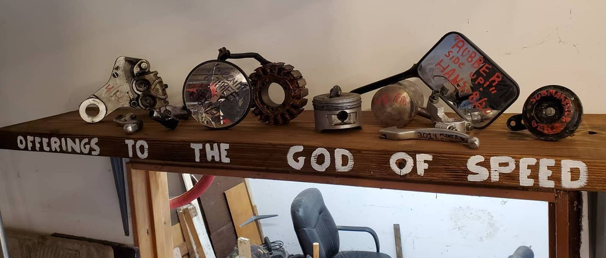

 

I bought a large bin of C-clamps from an estate sale for only a few dollars a few years ago. I think I spent $5? maybe $10? Since then, most of the clamps had been either out of sight in the bin or clamped to  a <a href="https://en.wikipedia.org/wiki/Burt_Munro">Burt Munro</a> inspired shelf I have over my door for dirtbike parts I've broken. The clamps kept falling off when I'd close the door too hard.

  As usual, I was too busy doing the project to take progress photos, but I can provide measurements. I had an idea of what I wanted to do, but ultimately didn't come up with this design.

  I had some leftover conduit from a project so I turned to google and looked for some examples of clamp storage that used it and found almost the exact design I vaguely had in my head. I came up with the 12" measurement between the conduit to accommodate longer clamps in the future. The main difference between my rack and Popular Woodworking's is that I didn't take the time to dado slots for the 1x3 stringers in the 2x4s. For garage/tool storage, I typically care about function over form. 

### Sources:
- [Popular woodworking Universal Clamp rack](https://www.popularwoodworking.com/projects/universal-clamp-rack/) 
- [Popular woodworking list](https://www.popularwoodworking.com/tricks/7-ways-to-store-clamps/)

## Material & Tools

- 1 2x4,
- 90" of 1/2 or 3/4 conduit (I used 1/2 conduit, the external measurement is close to 3/4)
- Forstner Drill bit
- 24 - 1 1/2" or larger Screws for assembly and mounting. I prefer [Star drive construction screws](https://www.homedepot.com/p/Grip-Rite-8-x-1-5-8-in-Star-Drive-Bugle-Head-Construction-Screw-10-lbs-Box-158GCS10BK/204959298) for stuff like this.s

## Measurements

- 3 - 31 1/2" 1x3
- 2 - 36" 2x4 
- 3 - 30" cut of 1/2" Conduit
- Holes drilled 6" from the top and bottom with center hole 12" from top and bottom holes
- Holes ~2" from the wall side of 2x4
- Holes 1" deep. This gives about 1/4" of play side to side.

  

     
    
 Nevermind the oil all over the wall from my last fork service

    
    
Since these small ones don't have a lot of lip and they are shallow, they need to either be closed or flipped over upside down to avoid falling off

  

  
