

   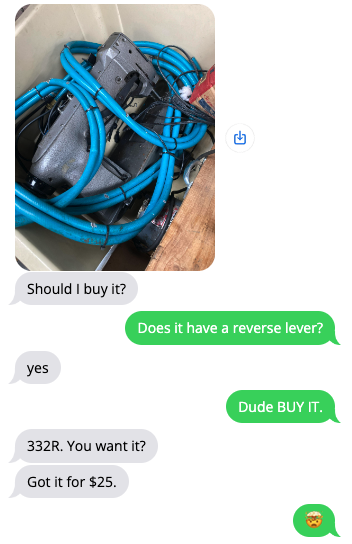

  

  
  
I paid him more than $25. A finder fee seemed appropriate.

  
But now I had a problem, I had assumed the 332r would fit my 226 table. Too many cheap Consews, what a life.

  
First off, lets talk about the machine. It should be obvious but $25 for a double needle japanese-made industrial sewing machine is absurd. I found other consew dual needle machines ranging in price from $900-1500 on ebay and locally. I don't need one badly enough to pay that kind of money for one, but paying my friend < $200 for one was  a steal. We agreed I owe him some beers when I sell it and inevitably have a windfall cashout.

  
The 332r is ~2Inches wider than my <a href="https://www.youtube.com/watch?v=GBF0ECECi4c">226r (single needle, compound walkingfoot)</a> so the table I had wouldnt work. Its for the best, swapping 50-60lb sewing heads would get old.

  <h2>Options:</h2>
  <ul>
    <li>Find/Buy a new industrial table for this relatively obscure machine. $250 for kframe tables before freight in 2024</li>
    <li>Buy a desk or table and hack into it with frankensteinesque angst </li>
    <li>Build 2x4 frame, top.</li>
    <li>Get lucky and find one second hand not attached to a sewing machine?</li>
  </ul>

  <h2>Runner Up:</h2>
  
My favorite unlisted option by far is the unrealized dream of making a mobile base mimicking the ancient portable singers of the 1920s/30s where treadler machines were converted to have a frame mounted motor. My version would have the common 1hp consew servo on it with a digital pedal. Someday, not today.

 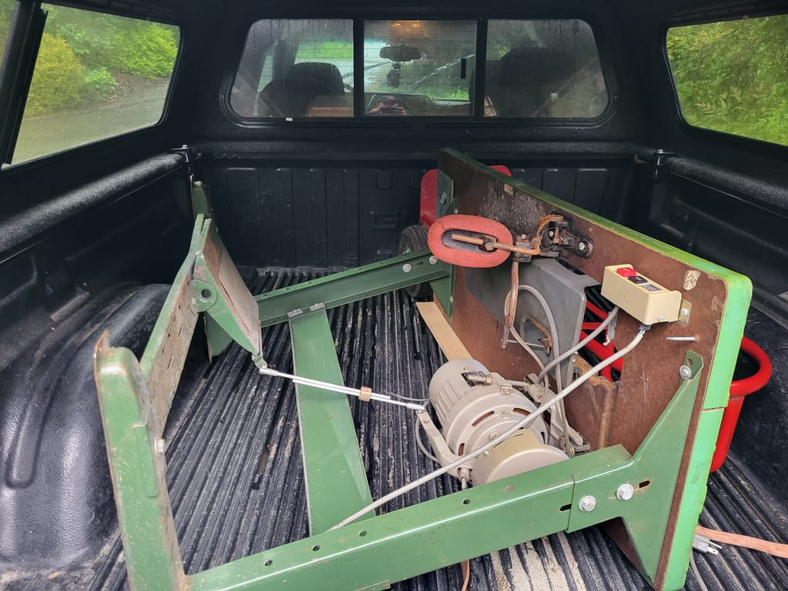
  
My luck held and later that week I found an industrial table with a warped top for $60 a few miles away. I found a sheet of 3/4 particle board in the back of my garage from a freight shipment I had received last year. Cabinet grade ply would have likely been <em>better</em>, but I was trying to build on the cheap. I laminated 2 layers of the particle board with a half bottle of titebond.

  
I generally used my current table for determining the position of the slot for the machine. The new frame is not as nice as my current table but the dimensions were the same, 48x20.

  

    Notably these machines only rest on the 4 corners of its body. In my case the casting was made to accept a 3/4 x 3/4 radiused corner. I roughed the hole out with a a few tools until I found the right one.
  

    I blew up a nearly new trim router cutting one side of the slot. I got impatient and had it taking more material than it was meant for. I tried a jig saw. It worked well for the detail around the stands in the corner but it moved slowly, they also are not made for 1.5" of material at a time. Finally, I used my circular saw to plunge cut the long sides of the slot. That meant there was a bit of sanding after the rough in. I forgot to get post-sanding pics.
  

  

    

      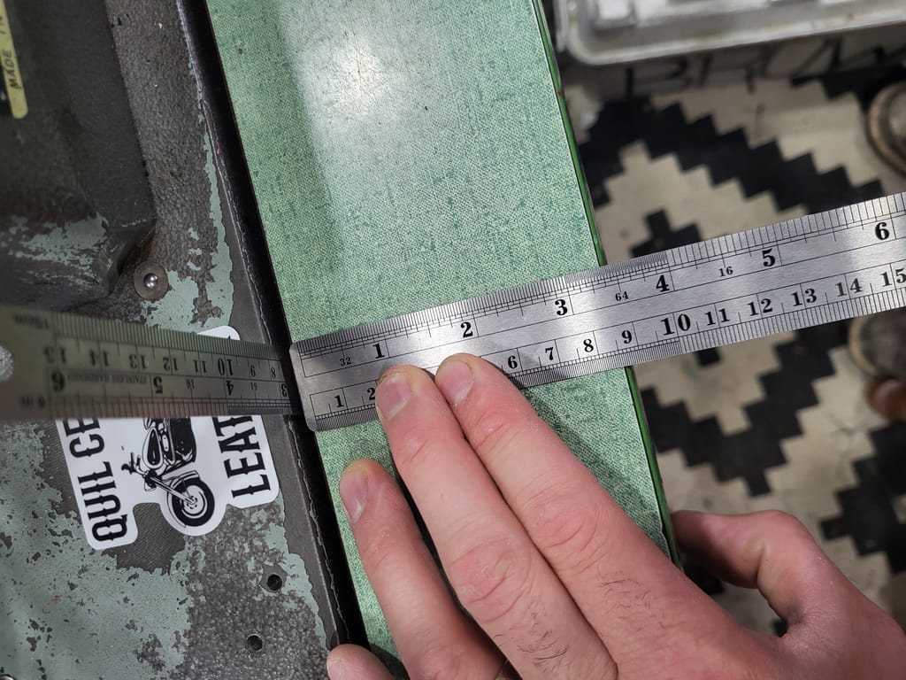  
      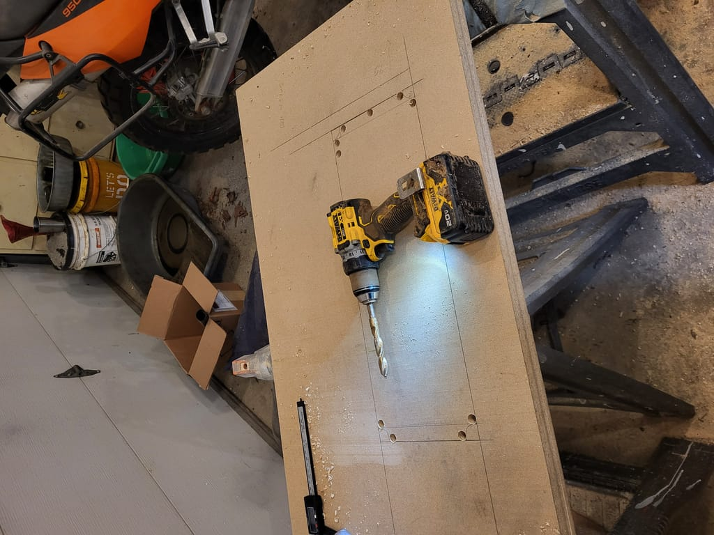
      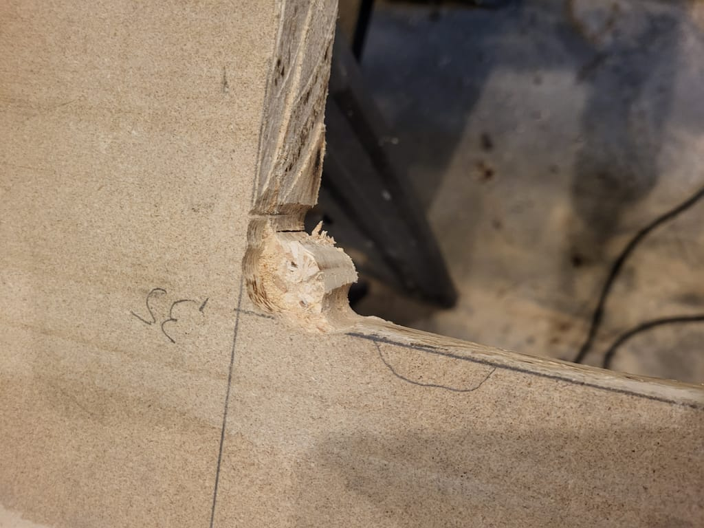  
      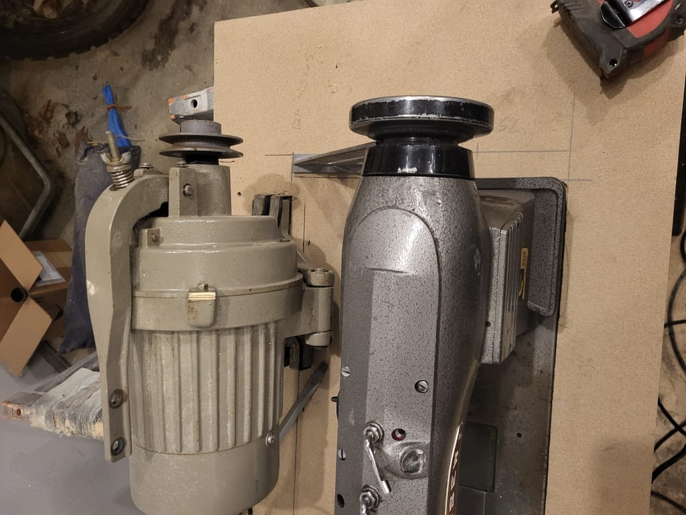
    

    

      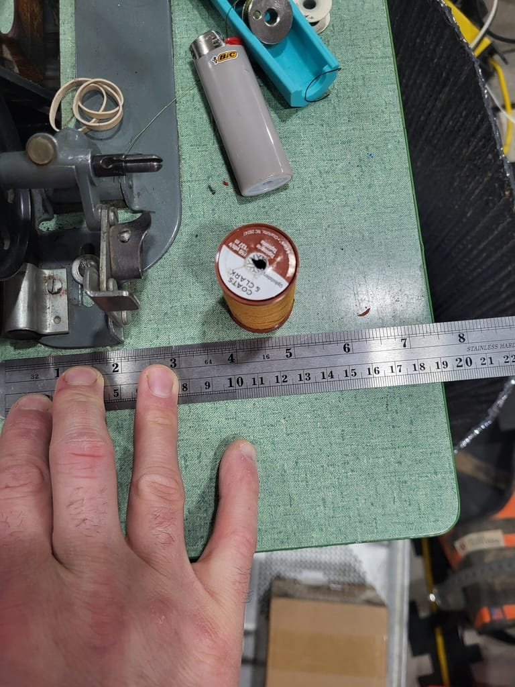
      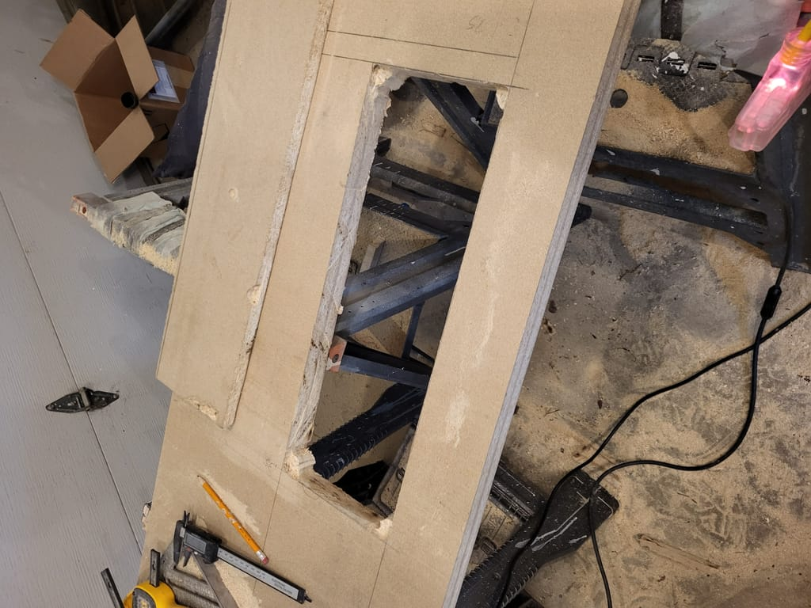
       
      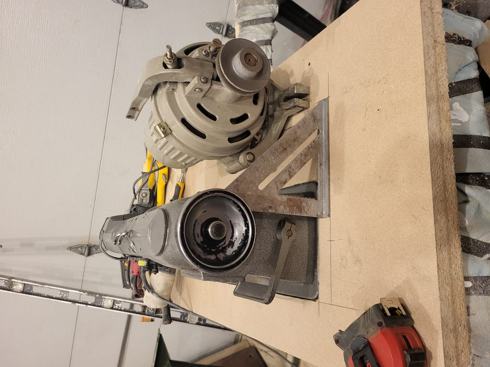
    

  

    <h1>How are these bobbin doors going to open?</h1>
    
 I thought I was being smart using my calipers to determine the thickness of the casting (0.34") to level the machine perfectly with the tabletop. I forgot this machine had a left sliding door for the second bobbin.  

 My current solution is a stack furniture felt in the corners to build material for it to sit on. I only needed about 1/4" of relief for the corners. 

    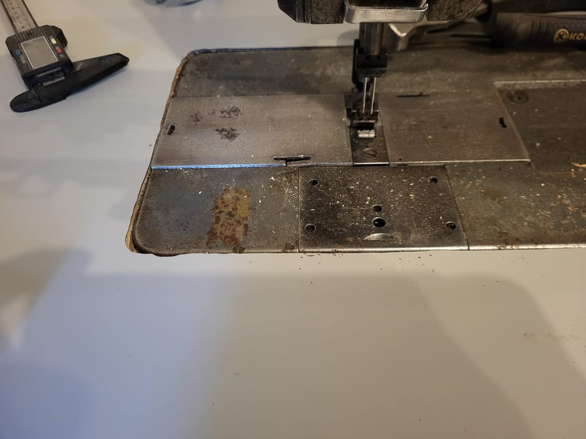 
    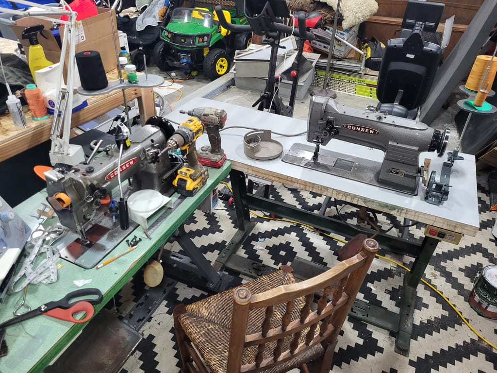 
    <video class="center" style="margin-top:4px"  controls>
      <source src="20240609_215620_compressed.mp4" type="video/mp4">
    Your browser does not support the video tag.
    </video>
    
 I used this for 10 minutes and ordered a consew servo. I forgot how hard the clutched motor is to control.

    
 There were also tensioning issues and I needed to fit new bobbin carriers since they were no longer holding the thread at a consistent tension. Consew 226r bobbin carriers will fit.

  

 