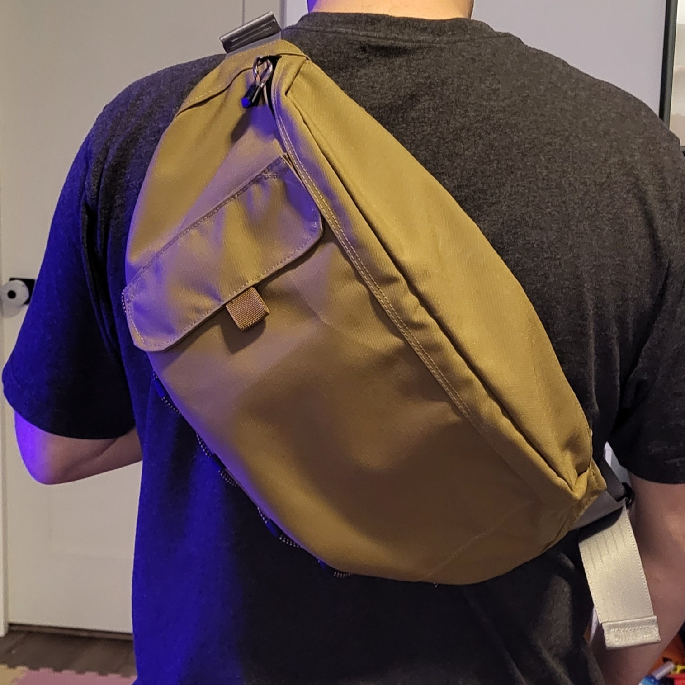
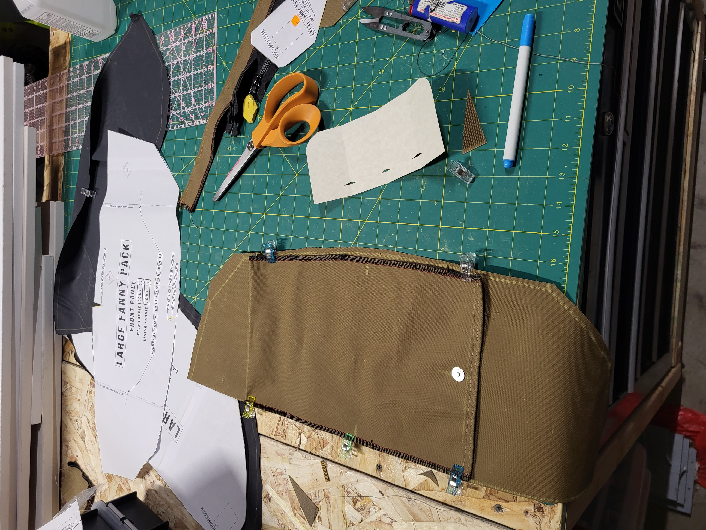
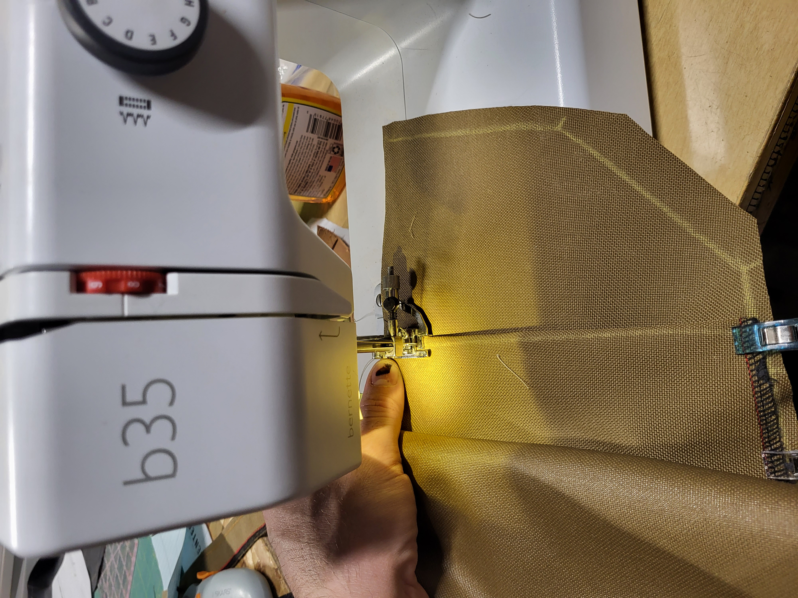
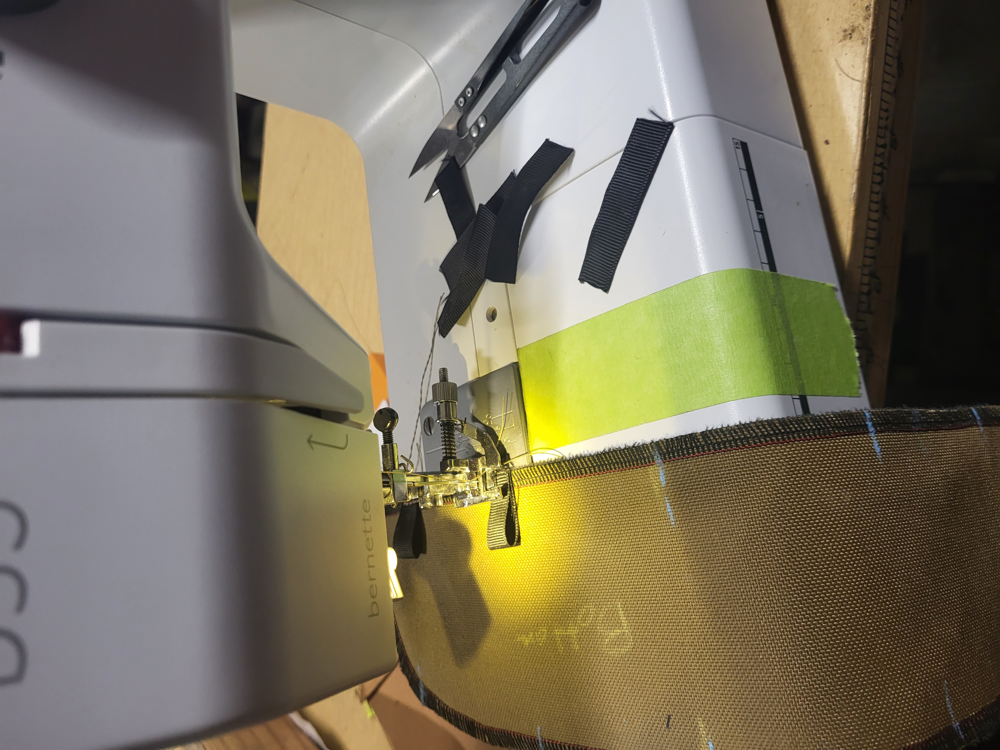
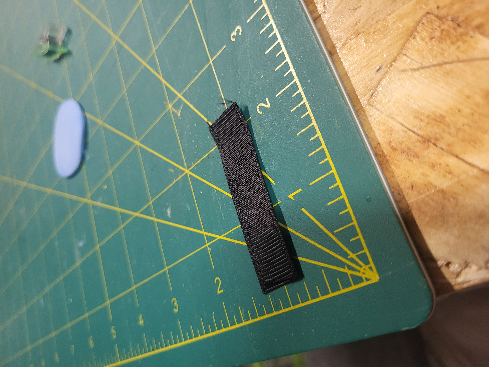
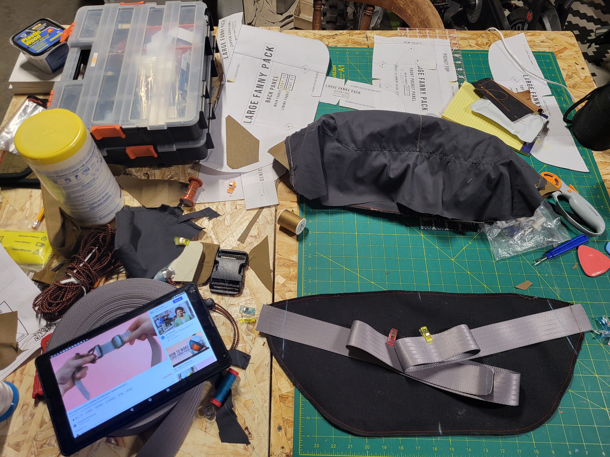
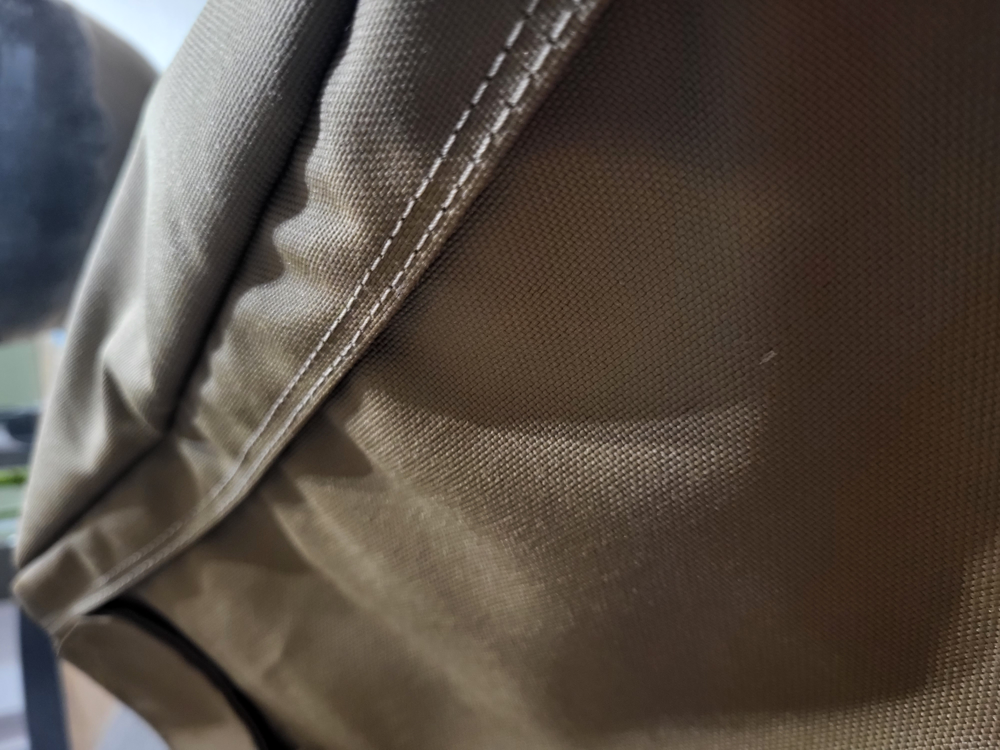

  

Last night I finished my [Proper Fit Clothing's](https://www.properfitclothing.com/product-page/large-fanny-pack-pattern-download) Large Fanny pack! 

The designer suggests using a serger and a a sewing machine with a foot with adjustable guide for the top stitch. I found my serger for $80 used, after using this method of serging the liner to the outer fabric I don't think I'll go back.

## Specs

Material:
- Outer Fabric - 200d Cordura w/ DWR
- Lining - [3.4oz Supplex taffeta](https://ripstopbytheroll.com/products/nylon-taslan)
- Strap - 2" Seatbelt

Hardware/Notions:
- 2x 24" ykk nylon zippers (i cant remember size)
- zipper pulls + paracord
- 2" webbing triglide
- 2" nylon buckle
- 150 yards Coats & clark Upholstery thread (I used all of it, somehow)

Tools:
- Bernette b35
- Bernette 004d Funlock serger
- Seam ripper

  

    
  

  

      
  

  

    <b>Modification:</b>
    DWR is a rubbery coating on the backside of the Cordura. It can be an absolute pain to sew with since it doesn't want to glide through the machine. I've read that it can also degrade from friction if a liner isn't over it, so I added some liner material inside the outer pouch. I did not get a picture of that step.
  

  

 
  

  

  
  

  

    <b>Modification:</b>
    I added ribbon to the bottom piece for adding a 1/8 bungee grid. 2" strips turned into about 1/4" loops. After all the stitching one was barely big enough to fit the bungee, next time I would add 1/2" to each piece.
  

  

    
  

  

    
  

  

    <!--  -->
     
  

  

    
  

<!-- Landscape -->

  

  

    
  

  

    
  

<!-- Landscape -->
As far as I know, these patterns don't come with written instructions, but each comes with a tutorial video! For me, I'd rather see someone fold and sew than read them describing it.

  

I got a bin of hardware for free on craigslist a few years ago from a sewing instructor who was moving across the country! I got a bunch of webbing hardware, webbing, zippers, grommets and a roll of this silver/grey 2" seatbelt material! I like the touch & feel better than the webbing I had on hand.

<!-- 

  

    <b>Modification:</b>
    The pattern calls for taking 36" and cutting it into two pieces, 29" and 7". I cut two 29" pieces because I'm not as skinny as the designer and I'd rather have too much and trim it down later.
  

 -->

  

    
  

  

     

        <b>Modification:</b>
        

        The pattern calls for taking 36" of webbing and cutting it into two pieces, 29" and 7". I cut two 29" pieces because I'm not as skinny as the designer and I'd rather have too much and trim it down later, I also left sewing the straps until later to avoid rethreading the machine.
        

    

  

 

      <b>Unpictured:</b>
      
I discovered some of my pieces were not cut perfectly so not all of the pieces would align. I knew I'd likely have a chance later to hide these issues. I was right, but it does come with some trade offs. The final 2 pieces that are stitched are the triangular shapes at the base of the straps. I had to elongate both to make it all fit and to include layers under them in the seam. I was fine with this asymmetry since it'll be used as a shoulder bag and not a true fanny pack. 

 

<h1> Details </h1>

  

  

    
  

  

    
  

  

    
  

  

    
  

