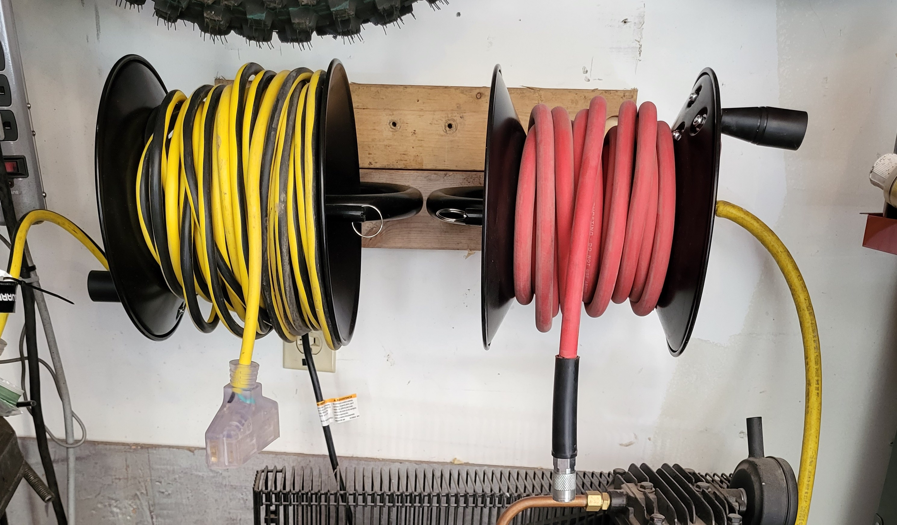
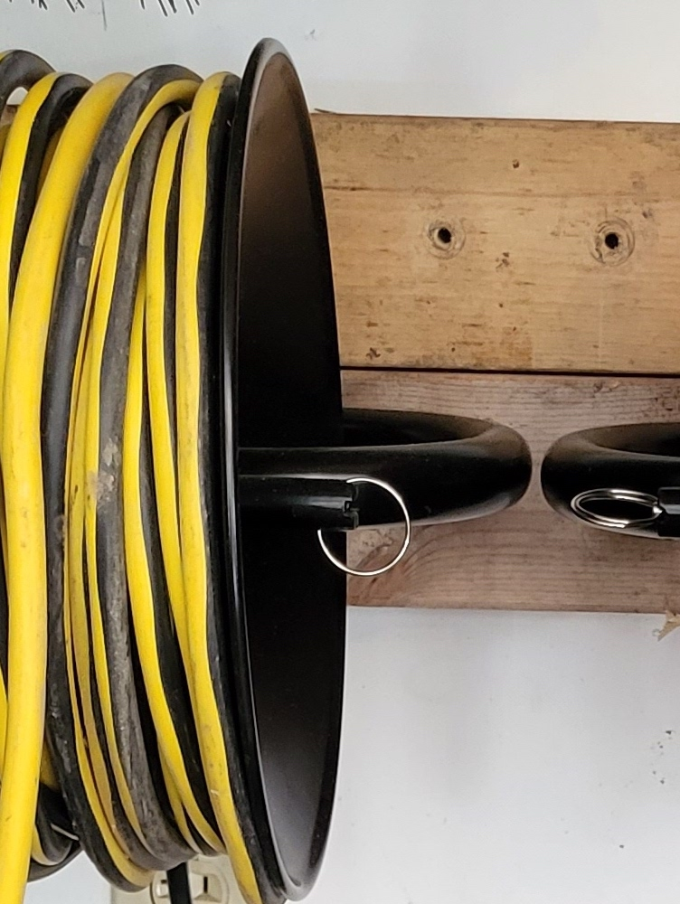

     

  I built an air & power station using <a href="https://www.harborfreight.com/air-hose-reel-40131.html">Harbor freight's Air Hose Reel</a>. I briefly had an auto-retracting air hose reel but it worked inconsistently. Also, I kept reading negative reviews of all of the auto-retracting air hoses under $100 and with my own experience with the problematic one, I decided I could live with a manual system. The additional benefit is that the spool will fit 50ft of <a href="https://www.harborfreight.com/lawn-garden/outdoor-living/extension-cords/50-ft-x-103-gauge-triple-tap-extension-cord-yellow-62916.html"> 10-3 extension cord </a> and even more of a thinner gauge wire. I got this idea from a product review on HF.

The caveat with the extension cord setup is that it must be unplugged to spin the spool. Though the spool locks in place so you don't need to worry about it being pulled negligently. 

## Construction

  The reel body is steel. The handle is a plastic or polymer. Like most Harbor Freight pneumatic tools, it doesn't come with an air fitting. At this point, I expect steel products from harbor freight to be pretty good or to at least be on par with other foreign made tools. Although I've heard the castings on their vises are crap. And then there is the jack stands. Or the Pittsburgh vise grips. Ok, it's hit or miss but this fully belongs in the <em>"Win"</em> column next to their tool boxes.

<a href="https://www.amazon.com/AmazonBasics-Manual-Hose-Reel-Included/dp/B087RJK3GW/ref=asc_df_B087RJK3GW/?tag=hyprod-20&linkCode=df0&hvadid=532655541111&hvpos=&hvnetw=g&hvrand=2995081822018374626&hvpone=&hvptwo=&hvqmt=&hvdev=c&hvdvcmdl=&hvlocint=&hvlocphy=1027583&hvtargid=pla-1370522095180&th=1">Amazon Basics</a> has a similar product too [Not an affiliate link].

  

      
  

  

    
  

