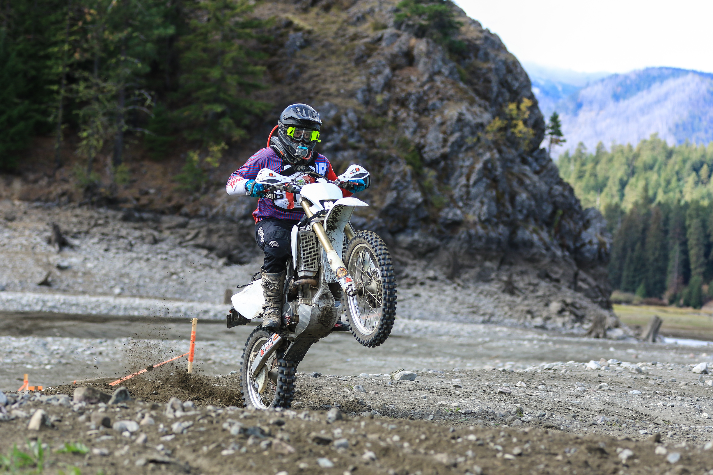

  

Rode some races. Had some fun. Made friends. 

I was riding a 2009 crf250x I had put about 150hrs on. I had nothing but trouble with it. It felt like playing wack-a-mole. Something would go bad so i'd replace the system, just for something else to go bad.

It was anemic on the hills at eddieville. I would hold it wide open in 2nd gear and shift into 3rd and it would bog down. I'd have no power.

The last straw was going to Packwood and having the bike not get past idle the morning of the race. Clogged jet from something in the fuel system that got past both fuel filters.

Started shopping for a 2t 300.

<a href="https://nmaoffroad.org/2021-race-results/">2021 NMA Race Results</a>

  
 

   

     
