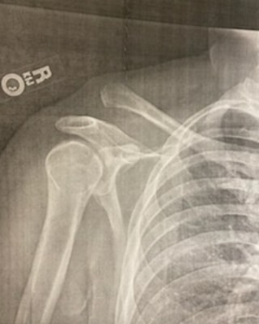

  

      
  

  

    In a severe misunderstanding of speed and torque I separated my AC joint in December 2021. I tore all 3 ligaments holding my collar bone into my shoulder test riding my friend's new-to-him ktm 300. In the days following the incident I thought I was done riding forever. I couldn't lift my arm and I didn't sleep for a week. It halted my home renovation for months.

  

    However, 6 weeks of PT - Mostly lifting 3lb weights and pulling on rubber bands got me in shape enough that I could steer the bike without much pain. I decided I wasn't done. My confidence is shaken but If I walk away from riding, I don't want it to be because I'm afraid. 
  

  

  My first race back, I DNF'd in the thick mud in Eddieville. The mud was axle deep and people's tires were gummed up with mud at the start line. There were swaths of racers lining the hills off their bikes pushing them. I didn't have the strength to pick up my bike in the slippery mud. It resulted in me sitting on my Honda on a hill in the middle of the track. Mid-race my clutch went out. Reckluse clutch packs aren't torqued to a spec like a factory one is, they have an adjustment. The friction discs weren't completely gone when I opened it up, but they had worn past being able to grip with it as configured.

The next 2 races in the season are back-to-back on the same weekend (Frostbite + WhiteKnuckle). I missed them while dealing with the clutch on the honda.

  Then I bought the bike from my friend that broke my shoulder.

  ...and rode it off the loading dock at Packwood Hare Scramble

  I raced 5 of 8 races in the series. 2 bike related DNFs (Clutch + flat tire @Rimrock), 3x 3rd place for the NMA Class.

<a href="https://nmaoffroad.org/2022-race-results/">2022 NMA Race Results</a>

  

      
  

  

   
  

    

   

  
10 months after my shoulder injury - god, this hurt. 

       

 
 it's practically a participation trophy, but I'm still proud I got back on the horse 

     

